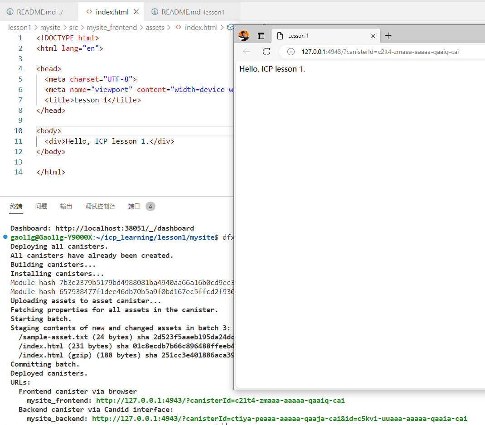
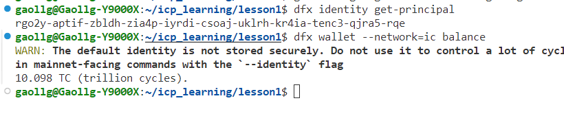

## 作业1：安装并使用 SDK 在本机搭建一个简易网站 。（2 分，请提交源代码+截屏）

## 作业2：通过优惠码领取主网 cycles 钱包（2 分，请提交身份的 principal id，和钱包余额的截屏）

rgo2y-aptif-zbldh-zia4p-iyrdi-csoaj-uklrh-kr4ia-tenc3-qjra5-rqe

## 作业3：将网站部署到 ic0.app 主网。 （3 分，请提交部署的网址 URL）

<https://l32yl-kaaaa-aaaan-qjgeq-cai.icp0.io/>

## 思考题：假如开发团队不再维护代码了，用户该怎么办？（3 分，请以文字描述，本题为开放题）

尽管 Web3 号称去中心化、开源，但让个人用户去接手开源代码，很难。故而：

1、若特别看好项目，应积极参与社区建设。有人、有钱、有组织架构，方能继续。

2、若不看好项目，或无力推动、参与，尽快出清资产止损。
